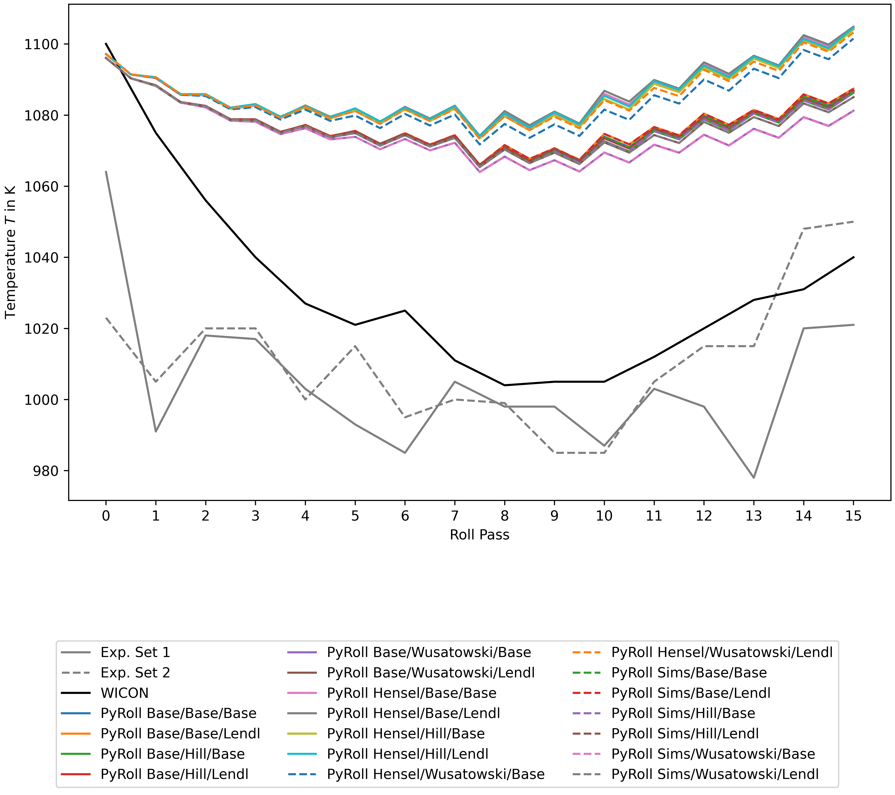

# PyRoll Benchmark Environment

This repository contains a virtual environment specification using [PipEnv](https://pipenv.pypa.io/en/latest/).
The [Pipfile](Pipfile) contains the necessary PyRoll packages as well as dependencies for analysis of the results.
Run `pipenv install` to set up the virtual environment.

The aim of this repository is to provide an environment for testing the influence of different model approaches loadable
as plugins in PyRoll.
One may edit the [task_config.py](pyroll_pub1_benchmark/task_config.py) file to specify a two-dimensional matrix of plugins to use.
The scripts provided in this repository will execute a PyRoll run with each possible combination of those plugins and
generate CSV tables as well as plots for comparison of the results with each other and 2 different experimental data
sets and simulation results obtained from the commercial
[WICON software by Morgårdshammar AB](https://www.morgardshammar.se/rolling-mill-simulation-software-wicon.html).
The scripts are set up using the [PyTask](https://pytask-dev.readthedocs.io/en/stable/) task automation library.
Just run the command `pipenv run pytask` in the root directory of this repository to trigger all steps of data
generation and
analysis.

## The Task Configuration File `task_config.py`

The [file](pyroll_pub1_benchmark/task_config.py) contains several common definitions used in the tasks.

The `PLUGINS` dict specifies the set of plugins, grouped by the type of model they provide.
In the provided configuration currently 3 types of models are specified:

1. Models for roll force and torque
2. Models for spreading
3. Models for calculation of the equivalent rectangle (equivalent flat roll pass)

The value of each dict entry must be a list of plugin modules that shall be imported (all stripped of the
prefix `pyroll.`).
An empty string means that no additional plugin of this type shall be loaded, thus the base configuration is used (which
is later displayed with the keyword "base").

## The PyRoll Input File `input.py`

The [input file](pyroll_pub1_benchmark/input.py) defines an industrial roll pass sequence starting with two box passes and continuing with
alternating oval and round passes.
See the [documentation](https://pyroll.readthedocs.io/en/latest/) for further information.

## The PyRoll Configuration File `config.yaml`

The [file](config.yaml) specifies plugins used by all variants as well as logging config.
See the [documentation](https://pyroll.readthedocs.io/en/latest/) for further information.

## Static Data

The directories [`measure`](measure) and [`wicon`](wicon) contain static data sets of roll torque and temperature along
the pass sequence
obtained from measurements in industrial environment resp. from WICON simulation results.
The roll torques were measured by the electric current in the roll driving motors.
The temperatures were determined with a pyrometer right after the roll gap, and can therefore be considered as surface
temperatures.

## Generated Data

The PyRoll runs will generate export and report files in the [`pyroll`](pyroll_pub1_benchmark/pyroll)
directory with subdirectories named according to the used plugins.

These files are read by the analysis scripts and condensed.
The files [`temperate.csv`](pyroll_pub1_benchmark/temperature.csv) and [`torque.csv`](pyroll_pub1_benchmark/torque.csv) 
will be generated containing a comparison of data obtained from measurements, WICON and the PyRoll runs.

## Generated Plots

The analysis scripts will generate plots of roll torque and profile temperature according to the different model
approaches from PyRoll as well as the experimental sets and WICON named `torque.*` and `temperature.*`.
The `*` denotes different file formats.

The analysis scripts will also create plots which highlight the differences which are effected by varying the respective
model approach.
The files are named `torque-<key>.*` and `temperature-<key>.*`, where `<key>` is the placeholder of the keys in
the `PLUGINS` dict in the [config](#the-pyroll-configuration-file-configyaml).
An example is shown below, where the three different force models are distinguished by color.
The multiplicity of curves for each model arises from varying the other models approaches, but those are not
distinguished here.

